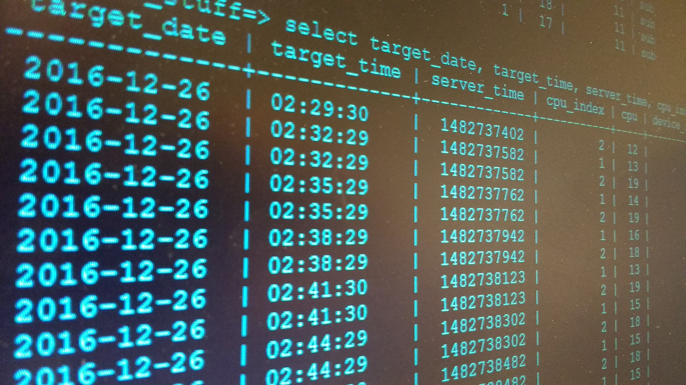

# Database Thinking

>A database is an organized collection of data, stored and accessed electronically.

<https://en.wikipedia.org/wiki/Database>

    

## 0. Mục tiêu

- Nắm được kiến thức căn bản về cơ sở dữ liệu (database)
- Biết cách thiết kế database để lưu trữ và truy vấn dữ liệu
- Biết cách tối ưu truy vấn dữ liệu
- Biết cách sharding database
- Lựa chọn và thiết kế database phù hợp với từng bài toán

## 1. Nội dung

### 1.1 MySQL cơ bản

- Hiểu được các mục trong file `01-mysql.md`

### 1.2 Database design

- Hiểu được các mục trong file `02-database-design.md`

### 1.3 Query Optimization

- Hiểu được các mục trong file `03-query-optimization.md`

### 1.4 Sharding

- Hiểu được các mục trong file `04-sharding.md`

## 2. Bài tập

Xem trong file `assignment.md`

## 3. Đánh giá

- Ghi chép lại những gì đã học, các khó khăn, chưa hiểu, . . . thành tài liệu.

- Hoàn thành các bài tập trong từng nội dung

- Hoàn thành bài tập lớn
